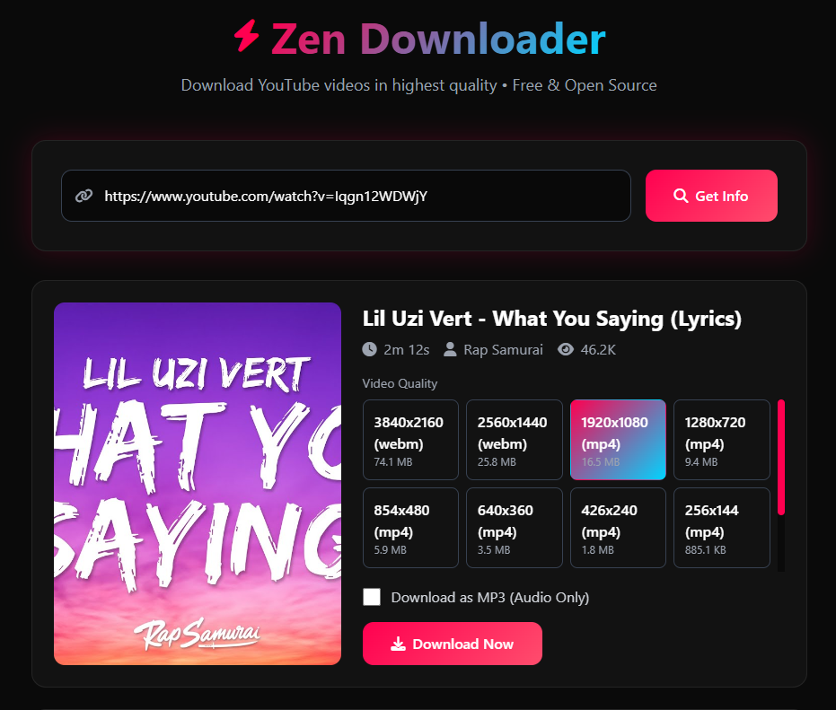

# Zen Downloader

<p align="center">
  
  
  
  
</p>

A modern, feature-rich YouTube video downloader built with Flask and yt-dlp. Download videos in highest quality, extract audio as MP3, or grab entire channels and playlists - all through a beautiful browser-based interface.

## Screenshots



## Features

- **Video Download** - Download YouTube videos in up to 4K quality
- **Channel/Playlist Support** - Download entire YouTube channels or playlists
- **Audio Extraction** - Extract audio as high-quality MP3
- **Quality Selection** - Choose from 144p to 4K resolution
- **Real-time Progress** - Live download progress with speed indicator
- **Modern UI** - Sleek, responsive dark theme interface
- **Auto Tool Check** - Automatically detects if FFmpeg and yt-dlp are installed
- **Auto Setup** - One-click setup.bat handles everything
- **Open Source** - Free to use, modify, and distribute

## Quick Start (Windows - Recommended)

### Option 1: One-Click Run (Easiest)

```batch
:: Just double-click run.bat - that's it!
run.bat
```

The `run.bat` will automatically:
- ✓ Check if Python, FFmpeg, and dependencies are installed
- ✓ Run setup.bat if anything is missing
- ✓ Start the server
- ✓ Open your browser to the app

### Option 2: Run Setup First

```batch
:: First-time setup
setup.bat

:: Then run the app
python app.py
```

### Option 3: Manual Setup

```bash
# Install dependencies
pip install -r requirements.txt

# Run the server
python app.py
```

Open [http://localhost:5000](http://localhost:5000) in your browser.

## Quick Start (macOS / Linux)

### 1. Install FFmpeg

**macOS:**
```bash
brew install ffmpeg
```

**Linux (Ubuntu/Debian):**
```bash
sudo apt update
sudo apt install ffmpeg
```

**Linux (Fedora/RHEL):**
```bash
sudo dnf install ffmpeg
```

### 2. Install Dependencies & Run

```bash
pip install -r requirements.txt
pip install -U yt-dlp
python app.py
```

Open [http://localhost:5000](http://localhost:5000) in your browser.

## Requirements

| Requirement | Version | Notes |
|-------------|---------|-------|
| Python | 3.10+ | Required |
| **FFmpeg** | Latest | **REQUIRED** - For video/audio processing |
| Internet | - | Required for downloading |
| yt-dlp | Latest | Auto-installed with requirements.txt |

## Project Structure

```
zen-downloader/
├── app.py                 # Main Flask application
├── run.bat                # One-click run (Windows)
├── setup.bat              # Auto-setup script (Windows)
├── requirements.txt       # Python dependencies
├── bin/                   # FFmpeg storage (downloaded by setup.bat)
│   └── .gitkeep
├── downloads/            # Temporary download storage
├── static/
│   ├── css/
│   │   └── style.css
│   └── js/
│       └── main.js
└── templates/
    └── index.html
```

## Troubleshooting

### "FFmpeg is not installed" Error

Just run `run.bat` - it will automatically run setup and install FFmpeg if needed.

**Windows:** Run `setup.bat` again - it will download FFmpeg automatically.

**Manual Install (Windows):**
```batch
choco install ffmpeg
```

**macOS:**
```bash
brew install ffmpeg
```

**Linux:**
```bash
sudo apt install ffmpeg
```

### YouTube blocked / No video found
- Ensure the URL is correct
- YouTube may be blocking requests from your network
- Some videos may be region-locked or private
- Try updating yt-dlp: `pip install -U yt-dlp`

### Port 5000 already in use

```bash
# Edit app.py to change port=5000 to port=8080
```

## API Endpoints

| Method | Endpoint | Description |
|--------|----------|-------------|
| GET | `/` | Main page |
| GET | `/api/check` | Check if FFmpeg and yt-dlp are installed |
| POST | `/api/info` | Get video/channel metadata |
| POST | `/api/download` | Start download |
| GET | `/api/progress/<task_id>` | Stream download progress |
| GET | `/download/<task_id>` | Serve downloaded file |
| POST | `/api/cleanup/<task_id>` | Cleanup temp files |

## Technologies Used

- **Backend:** Flask (Python web framework)
- **Download Engine:** [yt-dlp](https://github.com/yt-dlp/yt-dlp)
- **Frontend:** HTML5, Tailwind CSS, JavaScript
- **Media Processing:** FFmpeg

## License

This project is licensed under the MIT License - see the [LICENSE](LICENSE) file for details.

## Disclaimer

This tool is for educational purposes only. Please respect YouTube's Terms of Service and only download content that you have the right to download. The developers are not responsible for any misuse of this software.

---

<p align="center">Made with ❤️ by Zen Downloader Team</p>
